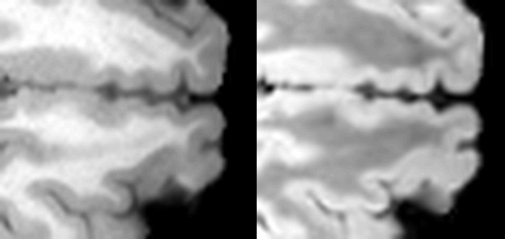
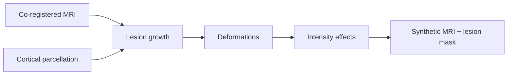

# SynthFCD


[](https://github.com/MaastrichtU-CDS/SynthFCD/actions/workflows/ci.yml)
[](https://www.medrxiv.org/content/10.64898/2026.10.01.26364470v1)

A phenomenological simulator of focal cortical dysplasia (FCD) on structural MRI.

SynthFCD is a scientific library and simulation engine: it grows anatomically
grounded lesion masks in healthy brains and applies a composition of
hand-crafted geometric and intensity transformations that emulate hallmark
radiological features of FCD.



## Motivation

FCD is a leading cause of drug-resistant focal epilepsy and is often subtle and
heterogeneous on routine MRI. Clinically representative labelled cohorts are
scarce. SynthFCD turns radiological knowledge into a controllable synthetic FCD
data generation engine, aiming to improve supervision of deep learning models and 
facilitate detection of underrepresented and challenging FCD cases.

The accompanying study used the engine to generate 2,164 synthetic examples from
healthy controls in FOMO300k, then pretrained segmentation models that were
fine-tuned on real FCD cases from the University Hospital Bonn (UHB) cohort.
Detection-rate gains reached 18.5 percentage points over training from scratch
and 7.4 points over self-supervised pretraining, with 0.366 DSC on the held-out
UHB benchmark. Those numbers describe one use of the simulator; the library is
meant to be reused, reconfigured, and extended beyond that experiment. Details
are in the
[medRxiv preprint](https://www.medrxiv.org/content/10.64898/2026.10.01.26364470v1).

## Simulation pipeline

Given co-registered structural MRI and a cortical parcellation, SynthFCD:

1. **Grows a lesion mask** from a seed on the grey–white boundary, with optional
   constraints on lobe, hemisphere, volume, grey-matter bias, and bottom-of-sulcus
   location.
2. **Applies local deformations** that alter cortical geometry (abnormal
   gyration, cortical thickening, sulcal widening).
3. **Applies local intensity effects** that alter tissue contrast (grey–white
   boundary blurring, texture restoration after smoothing, and
   hyper-/hypo-intensity, including WMH-like signal).

Deformations are shared across modalities of the same subject. Intensity effects
are drawn per sequence (`T1like` vs `T2like`) so T1-weighted and FLAIR/T2-like
contrasts can diverge in a physically consistent anatomy.



The shipped pipeline is called **SimpleFCD**. "Simple" means effects are applied
locally around a pre-grown lesion rather than along a neurodevelopmental
migration trajectory.

## Installation

Python 3.11 or newer is required.

```bash
git clone https://github.com/pkoutsouvelis/synthFCD.git
cd synthFCD
pip install -e .
```

Development extras (tests, linting, notebooks):

```bash
pip install -e ".[dev]"
```

Core dependencies include NumPy, SciPy, ANTsPy, MONAI, PyYAML, and
[nifti-finder](https://github.com/pkoutsouvelis/nifti-finder).

## Inputs

The simulator expects:

- One or more **co-registered** 3D NIfTI volumes of the same subject, in the
  same grid and spacing. Sequences are typed as `T1like` or `T2like`.
- A **integer parcellation** in that same space. The default label map is
  [SynthSeg](https://github.com/BBillot/SynthSeg) with `--parc` (FreeSurfer
  subcortical labels plus DKT cortex). A TensorFlow 2.15 / CUDA-friendly fork
  is [Photo-SynthSeg](https://github.com/MGH-LEMoN/Photo-SynthSeg/tree/synthseg_tf2.15).

Other label schemes work if you subclass `synthfcd.utils.LabelEnum` and pass it
as `label_enum`.

For the batch workflow, each subject directory should contain sibling files
named by suffix, for example:

```
sub-01/
  sub-01_T1w.nii.gz
  sub-01_FLAIR.nii.gz
  sub-01_synthseg.nii.gz
```

## Quick start

### Array API

The lowest-level public entry point operates on NumPy arrays:

```python
from synthfcd.pipelines import simple_fcd_simulator
from synthfcd.presets import draw_simple_fcd_params

params = draw_simple_fcd_params(
    sequences=["T1like", "T2like"],
    presets="default",
    random_seed=0,
)

result = simple_fcd_simulator(
    images=[t1, flair],          # list of float32/float64 3D arrays
    seg_mask=seg,                # integer 3D array, same shape
    spacing=(1.0, 1.0, 1.0),     # mm
    growth_params=params["growth_params"],
    deformation_params=params["deformation_params"],
    intensity_params=params["intensity_params"],
)

synth_t1, synth_flair = result["out_images"]
lesion_mask = result["extras"]["out_target"]
```

`draw_simple_fcd_params` samples a concrete parameter set from a named preset
bundle. You can instead pass a fully specified `custom_presets` dict, or call
`simple_fcd_simulator` with hand-written parameter dictionaries.

### Batch workflow

`SimpleFCDWorkflow` discovers subjects, draws parameters, runs the simulator,
and writes NIfTI / JSON / CSV outputs:

```python
from synthfcd.workflows import SimpleFCDWorkflow

workflow = SimpleFCDWorkflow(
    explorer={"patterns": "*_synthseg.nii.gz"},
    seg_mask_suffix="_synthseg",
    modality_suffixes=["_T1w", "_FLAIR"],
    modality_names=["T1like", "T2like"],
    param_presets="default",
    out_dir="outputs/synthfcd",
    num_workers="auto",
    random_seed=0,
)
summary = workflow.run(inputs="data/healthy_controls")
```

Directories are scanned with the explorer; individual NIfTI files can be passed
directly. When `out_dir` is set, the input folder structure is mirrored beneath
it. Outputs include warped images, the updated parcellation, the synthetic
lesion mask, per-subject growth statistics, and a parameter table
(`synthfcd_params.csv`).

### Command line

```bash
synthfcd path/to/config.yaml
synthfcd path/to/config.yaml --dry-run   # stage subjects, do not simulate
```

```yaml
workflow: simple_fcd
settings:
  explorer:
    patterns: "*_synthseg.nii.gz"
  seg_mask_suffix: _synthseg
  modality_suffixes: [_T1w, _FLAIR]
  modality_names: [T1like, T2like]
  param_presets: default
  out_dir: /path/to/out
  num_workers: 4
  random_seed: 0
inputs: /path/to/data
```

`inputs` may be a directory or a list of paths. `--dry-run` is CLI-only and is
not read from the YAML file.

### On-the-fly training transform

`RandSimpleFCDd` is a dictionary MONAI transform that redraws parameters and
runs SimpleFCD inside a training pipeline:

```python
from synthfcd.transforms import RandSimpleFCDd

transform = RandSimpleFCDd(
    keys=["t1", "flair"],
    sequences=["T1like", "T2like"],
    seg_mask_key="seg_mask",
)
```

## Presets

Named preset bundles control which FCD-like appearances are sampled:

| Key | Role |
| --- | --- |
| `default` | Mixed ILAE-inspired types I and II (the main sampling distribution) |
| `extreme` | Wider / stronger parameter ranges |
| `minimal` | Default geometry and intensity, with abnormal gyration disabled |
| `wmh_only` | Only the hyperintensity effect |
| `type_II_only` | Types IIa and IIb only |

Types are **phenomenological presets**, not histopathological labels. They bias
volume, location, grey–white involvement, and which effects are enabled:

| Type | Typical bias in the default bundle |
| --- | --- |
| Ia / Ib / Ic | Smaller, grey-matter–dominant lesions; sulcal widening; no cortical thickening; milder boundary change |
| IIa | Larger, often frontal; cortical thickening; stronger blurring and WMH-like signal |
| IIb | Largest volumes, more white-matter involvement; thickening plus stronger / deeper hyperintensity |

`get_simple_fcd_presets(key)` returns the nested sampling spec. Individual
entries use `Draw(...)` objects (choice, uniform, truncated log-normal, or a
callable). Nested string paths such as `"growth_params.bottom_of_sulcus"`
couple one parameter to another after sampling.

## Library layout

The package is layered so that the paper pipeline is one composition of reusable
parts:

| Layer | Module | Responsibility |
| --- | --- | --- |
| Primitives | `synthfcd.core` | Lesion growth, deformations, diffusion / intensity, warping, masks |
| Pipelines | `synthfcd.pipelines` | Sequential composition, local application fields, multimodal caches |
| Presets | `synthfcd.presets` | Parameter distributions and sampling |
| Transforms | `synthfcd.transforms` | MONAI `MapTransform` wrappers |
| Workflows | `synthfcd.workflows` | File discovery, parallel execution, I/O |
| CLI | `synthfcd.cli` | YAML config → workflow |

`synthfcd.core` is pipeline-agnostic. New simulators can mix existing growth
and effect functions, or add new ones that follow the same contracts
(image + parcellation + spacing in; warped image / mask / effect field out).

Effects currently implemented:

**Growth.** `grow_random_lesion` — distance-based or irregular connected growth
from a GM–WM seed.

**Deformations.** `abnormal_gyration` (smooth random diffeomorphic warps in the
ribbon), `cortical_thickening` (expansion along the GM–WM normal),
`sulcal_widening` (thinning / opening of the sulcus).

**Intensity.** `boundary_blurring` (anisotropic diffusion), `texture_restoration`
(band-pass residual texture after smoothing), `hyperintensity` (seeded
WMH-like / cortical signal change; sign flipped for T1-like contrasts).

## Extending the engine

- **Custom parameters.** Pass `custom_presets=` to `draw_simple_fcd_params` or
  `RandSimpleFCDd`. The dict must match the default key structure; disable
  individual effects with `"enable": False`.
- **Custom anatomy.** Subclass `synthfcd.utils.LabelEnum` and implement the
  lobe / tissue helpers. Pass the class as `label_enum` (in YAML: a registered
  name under `label_enum`, currently `SynthSegLabel`).
- **Custom pipelines.** Subclass `LesionSimulationPipeline`, set
  `TARGET_GROWTH`, `DEFORMATION_EFFECTS`, and `INTENSITY_EFFECTS`, and reuse
  `apply_effects_locally` / target-growth helpers. Register a new workflow in
  `synthfcd.cli.config.WORKFLOW_REGISTRY` to expose it on the CLI.

## Tests

```bash
pytest
```

Slow, visualisation, and implementation-exact tests are marked (`slow`, `viz`,
`exact`). Visualisation tests are deselected by default.

## Citation

If you use SynthFCD in academic work, please cite the
[medRxiv preprint](https://www.medrxiv.org/content/10.64898/2026.10.01.26364470v1):

```
@article {Koutsouvelis2026.10.01.26364470,
	author = {Koutsouvelis, Petros and Amirrajab, Sina and Volmer, Leroy and Eekers, Danielle B. P. and Schijns, Olaf E. M. G. and Brecheisen, Ralph and Dekker, Andre},
	title = {Simulating the Radiological Appearance of Focal Cortical Dysplasia in MRI},
	year = {2026},
	doi = {10.64898/2026.10.01.26364470},
	journal = {medRxiv}
}
```

## License

BSD-3-Clause. See [LICENSE](LICENSE).
